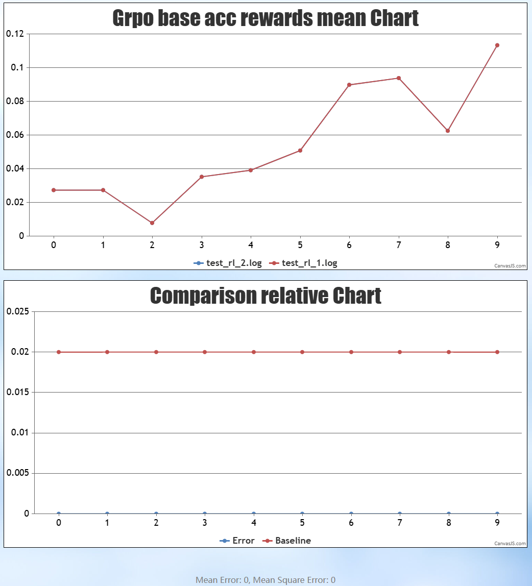

# 确定性计算

## 概述

确定性计算是指计算结果完全由输入决定，在给定相同输入的情况下总是产生相同输出的计算过程。如下图所示，开启后重复训练的reward分数完全一致。开启确定性计算可以方便地复现训练过程，进行问题定位。
 <p align="center">  </p>


## 配置流程

### 1. 数据输入一致
  - 1.1 设置shuffle参数
      > **注意**：在训练前删除数据集目录下后缀为.npy的缓存文件
      两次计算的数据输入需要保持一致，可以在训练脚本的yaml文件megatron_training参数中加入控制数据集输入
      MindSpeed RL 提供两个参数进行控制
      ```
      no_shuffle # 是否按epoch对数据进行shuffle, 默认为False, 对每个epoch进行shuffle，可用seed控制shuffle随机性
      full_shuffle_instruction_dataset # 是否在处理完所有epoch之后对完整的数据再进行shuffle，默认为False，不进行全局shuffle
      ```
      所以当前仓上保证两次数据一致可设置以下参数

      不开shuffle：

      ```
      no_shuffle: true
      full_shuffle_instruction_dataset: false
      ```

      开启shuffle并保证跑两次数据一致：
      ```
      no_shuffle: false
      seed: 1234
      full_shuffle_instruction_dataset: false
      ```
  - 1.2 使能TransferDock (TD) 保序特性
  
      TransferDock在Mindspeed RL仓中用于存取数据，控制数据流，数据取出默认是乱序的，vllm推理等对于数据的输入顺序是敏感的，两次训练需要保持一致的顺序才能有相同输出。开启此特性之后，将按实际数据顺序进行存取。

      使能方法，在rl_config参数中加入
      ```
      use_guarantee_order: true
      ```

### 2. 使能确定性计算参数
- 2.1 使能算子API确定性计算

    使能方法，在megatron_training参数中加入

    ```
    use_deter_comp: true
    ```

- 2.2 使能vllm确定性计算 （可选）

    vLLM 中的种子参数用于控制各种随机数生成器的随机状态，如果是从头开始训练两次，仅开启前文的确定性计算方法即可，如需要验证断点续训的确定性计算，需要设置该参数
    
    使能方法，在sampling_config参数中加入seed参数，数字仅为示例，可自行选取

    ```
    seed: 1234
    ```