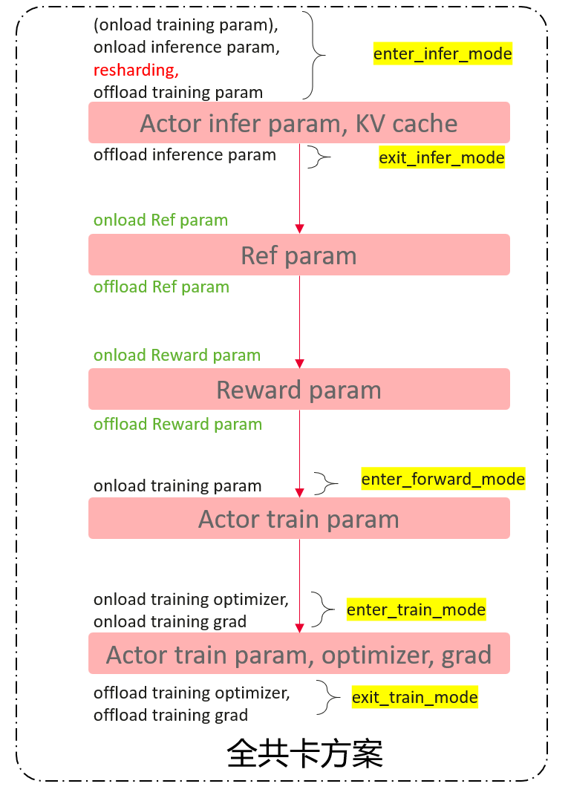
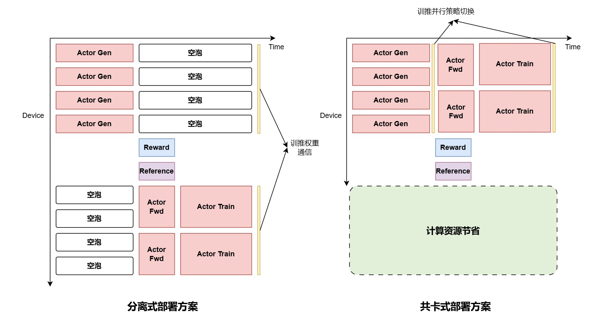
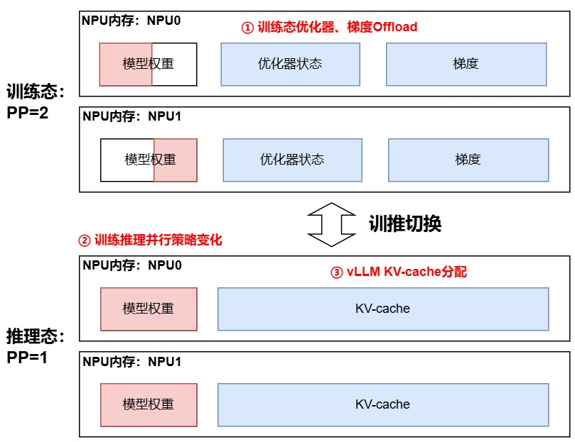

# 共卡机制介绍

## 全共卡部署
### 方案概述
MindSpeed-RL 仓库目前主推的部署方式为`全共卡部署`，即 Actor, Reference 等 worker 分时复用同一批机器资源，交替进行计算任务。 在全共卡配置中，为了节省显存，各个计算任务执行时只会将必要的数据加载到显存上，并在结束计算任务后，将加载的数据重新卸载到CPU侧的内存上。
整个训练流程中的显存调度过程可以参考下图：



目前仓库只支持全共卡配置方案，在全共卡配置中，Actor部分会进一步使用训推共卡的部署方案来节约资源，下一节还会对训推共卡技术部分进行进一步展开描述。

### 配置方法
全共卡情况下， ref_config 和 reward_config 会被自动忽略，复用 actor_config，因此在 config 中不应给出 ref_config 和 reward_config 。
actor_resource 应被理解为全共卡方案占用的总 NPU 数量，reference_resource，reward_resource等不应被设置。在 yaml 中相应的参数说明如下：

```yaml
rl_config:
  use_integrated_worker: true # use_integrated_worker 设置为 true 开启全共卡。
  blocking: true # 全共卡情况下应开启blocking。
  actor_forward_micro_batch_size: 8 # 用来单独指定 actor 计算 log_p 的 micro batch size，如果不配置，则复用actor_config 中训练使用的 micro_batch_size
  ref_forward_micro_batch_size: 8 # 用来单独指定 reference 计算 log_p 的 micro batch size，如果不配置，则复用actor_config 中训练使用的 micro_batch_size
  integrated_mode_config:
    ref_model_load_path: "path_to_ref_model" # 支持断点续训时单独加载 ref 权重，如果不配置，默认 ref 加载与 actor 相同的权重
```

## 训推共卡
### 背景介绍

在 GRPO、PPO 等 RLHF 算法中，主要耗时会集中在推理阶段，所以通常会使用专门的推理引擎（如 vLLM 等）对推理过程进行加速。 
因此，Actor 模型在训练过程中会同时存在推理态和训练态两种模式，在每轮训练中，Actor 模型需要在训练态和推理态间切换。



如果采用分离方案进行 Actor 部署，即将 Actor 推理态与训练态部署在不同的物理资源上，可能导致训练推理任务相互等待，资源利用率低。
即使采用了 MBS 间异步方案提升利用率，分离式部署的资源需求量也会远大于共卡部署方案，因此 Actor 共卡方案在资源量较为有限的情况下，是一种资源高效的部署方式。

### 技术概述

因此，本仓库提出一种强化学习后训练优化方案：训推共卡方式 Actor 部署。
该方案的核心在于通过训练与推理任务分时复用同一集群资源实现高效协同。具体而言，该方案包含以下关键技术：
1. 动态权重更新与并行策略转换：通过通信优化算法减少训推切换时的权重同步时延，并支持在线将专家并行（EP）转换为张量并行（TP），解决大规模 MoE 模型（如DeepSeek V3）因权重庞大（1.3TB）导致的内存溢出（OOM）问题。
2. 内存调度优化：在推理阶段将训练相关的优化器状态和梯度卸载至Host侧内存，降低NPU内存峰值，同时提升推理吞吐；训练时再将数据重新加载至 NPU 完成更新。
3. 训推任务无缝切换：基于 Megatron 和 vLLM 框架实现 Actor 模型的生成、推理、训练三阶段串行执行，通过分时复用资源减少模型级空泡，提升硬件利用率。

上述设计的主要优势包括：

1. 资源利用率提升：训推共卡避免了传统分离架构中资源闲置问题，尤其在MoE模型场景下显著降低卡数需求；
2. 高效适配复杂负载：支持训练（大TP/PP/小EP并行）与推理（小TP/PP/大EP并行）的不同并行策略需求，优化系统吞吐；
3. 低成本部署：通过内存卸载和权重转换技术，降低大规模模型训练的硬件门槛。

#### 设计抽象
训推共卡的 Actor 被实现为 `ActorHybridWorker` ，该类继承了 `BaseWorker` ，作为一个角色参与到 GRPO 的训练流程中， 
实现了包括 `generate_sequences`， `compute_log_prob` 和 `update` 的方法，包含了 Actor 在 GRPO 训练流程中的全部功能。
该类主要包括 `model`，`optimizer`，`inference_model`，`sharding_manager` 等成员，其中 `model`和 `optimizer` 是训练态的模型和优化器，当前基于 Megatron 框架实现；
`inference_model` 是推理态的模型，当前基于 vLLM 框架实现；`sharding_manager` 负责实现训推状态的切换，包括从训练状态到推理状态的权重切分转换及相关显存管理功能。


#### 具体实现

从训练态切换到推理态时，需要根据推理态的切分从训练权重构建出相应的推理权重，并将训练态的模型权重、优化器和梯度从显存上进行卸载，为推理时的 KV Cache 留出显存空间；
从推理态切换到训练态时，则只需将推理态的权重和KV Cache卸载，并重新加载回训练态的权重、优化器和梯度。



当前框架会自动启用训推共卡式 Actor，在配置文件中，可以对共卡情况下的训练态和推理态模型的切分策略进行分别配置，并设定在推理时是否需要对训练相关权重、梯度和优化器进行卸载。
以 `grpo_qwen25_7b_A3.yaml` 为例，

```yaml
actor_config:
  tensor_model_parallel_size: 4     # 训练态 TP 切分
  pipeline_model_parallel_size: 1   # 训练态 PP 切分
  expert_model_parallel_size: 1     # 训练态 EP 切分

generate_config:
  infer_tensor_parallel_size: 4     # 推理态 TP 切分
  infer_pipeline_parallel_size: 1   # 推理态 PP 切分
  infer_expert_parallel_size: 1     # 推理态 PP 切分

  offload_train_optimizer: true     # 设置为 true 可以使能在推理时卸载训练态优化器
  offload_train_grad: true          # 设置为 true 可以使能在推理时卸载训练态梯度
  offload_train_param: true         # 设置为 true 可以使能在推理时卸载训练态权重
```


