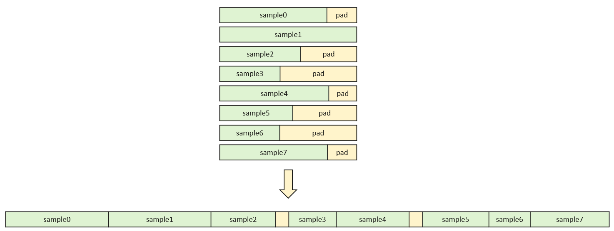

# 填充移除（Remove padding）特性说明
 
## 背景介绍

在大语言模型训练过程中，输入数据通常是由长度不一的序列组成的。为了能够将这些序列批量输入模型进行前向计算，传统的做法是将同一个批次（batch）内的所有序列填充（padding）到相同的长度，一般以该 batch 内最长的序列长度为基准，对较短的序列在末尾填充特定的 padding token（如 0），使其长度与最长序列一致。​
这种填充操作虽然解决了批量处理的问题，但也带来了明显的弊端。在模型进行前向计算时，会对包括 padding token 在内的所有位置进行计算，而这些 padding token 本身并不包含有效的语义信息，因此这部分计算属于无效计算，延长训练时间，降低训练吞吐率。例如，当一个 batch 中大部分序列长度远小于最长序列长度时，模型会花费大量时间处理无效的 padding token，导致计算资源的利用率低下。​
为了优化训练过程，减少无效计算，我们引入了 remove_padding 特性。该特性旨在消除 padding token 带来的无效计算，使模型仅对有效序列部分进行计算，从而提升训练的效率和性能。

## 方案概述

remove_padding 特性的实现步骤：

（1）预处理：在将一个 batch 内的序列输入模型之前，先移除每个序列的 padding 部分，然后将所有序列的有效部分拼接（packing）成一条完整的长序列。在连接过程中，记录每个原始样本在长序列中的起始位置和长度信息。

（2）前向计算：将 packing 后的序列传入模型做前向计算，注意力掩码（attention mask）可以手动构造成锯齿形，或者由flash attention根据序列累加长度列表自动生成。

（3）后处理还原​：根据预处理阶段生成的、记录packing中每条子序列长度的列表，对前向输出的 logits 进行精准拆分，通过将合并计算的 logits 按原始样本维度还原，最终得到与未采用改加速方案时等价的计算结果，确保模型训练效果不受影响。

## 配置方法
（1）在`megatron_config`中设置`variable_seq_lengths: true`；

（2）在`megatron_config`中设置`reset_position_ids: true`；

（3）在`rl_config`中设置`use_remove_padding: true`。