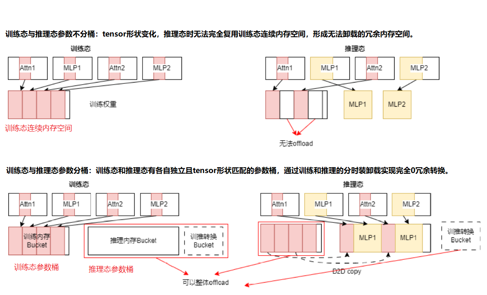

# 在线权重重切分（Resharding）特性说明
 
## 背景介绍
 
在大模型RL后训练过程中，模型训练全过程包含推理（生成）、前向计算、训练（前反向梯度更新）等多个阶段，且可能涉及待训模型（Actor）、参考模型（Reference）、评价模型或打分模型（Critic/Reward Model）。其中，待训模型（Actor）既要进行推理（生成），也需参与训练的前向计算及前反向梯度更新等过程，即训推并存，尤其在训练阶段模型权重采用megatron格式而推理阶段是vllm引擎以加速推理过程。因此，为支持各阶段最优并行策略的独立配置，达到尽量高的系统吞吐性能，同时避免多份模型权重对内存占用，在此提出训推共卡的Resharding特性，实现模型在训练-推理不同阶段中采用不同并行策略时的权重在线重切分功能。
 
## 方案概述
 
### 权重在线重切分（Resharding）模块架构设计
 
如下图所展示了训推共卡及权重在线重切分Resharding模块类的UML图。其中，ActorHybridWorker由训练引擎TrainEngine、推理引擎InferenceEngine及训推切换管理器ShardingManager组成，为训推共卡后训练混合引擎提供了统一接口封装，可以由控制节点统一进行算法编排或资源调度。
 
具体的训推过程权重切换及内存调度则全部由ShardingManager完成。用户可以直接传入训练引擎及推理引擎中的静态参数，如模型权重、优化器参数、梯度等，并对训练推理并行策略进行注册。训推切换过程中，ShardingManager会自动实现权重重切分，并对训练推理中其他参数进行调度。其中，ShardingManager中只需传入训练引擎及推理引擎初始化后的模型权重，内部没有对模型权重进行初始化的操作，因此不耦合训练及推理引擎类型，可以支持Megatron、VLLM及其他训练及推理引擎。
 

 
核心模块功能说明：

（1）ShardingManager：进行训练态及推理态转换的统一接口，完成训转推、推转训的在线权重重切分功能、内存调度等功能。该模块与训推引擎解耦，支持Megatron、VLLM及其他训练及推理引擎；
 
（2）WeightContainer：完成训练和推理不同并行策略下权重的重切分、实现从训练态到推理态的重新切分；
 
（3）WeightAdaptor：实现训练引擎（Megatron）及推理引擎（vLLM）权重格式转换统一接口，通过实现不同WeightAdaptor可以支持不同模型及训推引擎。
 
（4）MegatronOffloader：训练引擎内存管理模块，负责训练引擎中权重、优化器、梯度等内存管理调度。可以通过实现不同Offloader支持不同训练引擎内存调度。
 
### 训推权重分桶0冗余切换方案
 
训推转换时并行策略调整（如TP变化或EP变化）会引发权重张量形状变化，由于训练态中训练引擎对模型权重进行管理（如Megatron中会对权重分配统一MemoryBuffer），形状变化后的权重可能无法置于训练引擎所分配的连续内存空间（MemoryBuffer）中，因此会形成无法卸载的冗余内存空间。
 
为解决这一问题，提出基于参数分桶的训推内存0冗余切换技术，如下图所示。

（1）ShardingMananger初始化阶段，根据推理并行策略切分或推理引擎提供的权重元信息（MetaInfo）分配每个PP Stage所需的MemoryBuffer（推理参数桶）；
 
（2）进行推理态计算时，为每个PP申请推理参数桶内存，将训练态权重参数经过并行策略转换为推理态权重参数，并拷贝至推理参数桶中，同时，将训练态模型权重、优化器、梯度等全部卸载至CPU侧；
 
（3）进行训练计算时，从CPU侧加载并使用训练态参数据桶中的权重参数、优化器、梯度等，同时释放推理侧参数桶内存空间；
 
（4）完成训练态计算后，再次通过步骤（2）变为推理态进行计算。
 

 
由于推理态MemoryBuffer尺寸分配是根据推理引擎的权重元信息分配的，因此推理参数桶中不存在任何冗余内存。由此，通过训练推理参数内存上的隔离和训练态权重的装卸载，即可实现训推内存0冗余切换。
 
## 特性详细说明
 
### 参数配置方式
 
当前框架默认采用训推全共卡式部署（[全共卡部署](https://gitee.com/ascend/MindSpeed-RL/blob/master/docs/features/integrated_worker.md)），用户可以通过直接配置`actor_config`及`generate_config`指定训练及推理并行策略即会自动启用Resharding在线权重重切分。
 
```yaml
actor_config:
  tensor_model_parallel_size: 4     # 训练态 TP 切分
  pipeline_model_parallel_size: 2   # 训练态 PP 切分
  expert_model_parallel_size: 1     # 训练态 EP 切分
  
 
generate_config:
  infer_tensor_parallel_size: 2     # 推理态 TP 切分
  infer_pipeline_parallel_size: 1   # 推理态 PP 切分
  infer_expert_parallel_size: 1     # 推理态 EP 切分
 
  offload_train_optimizer: true     # 设置为 true 可以使能在推理时卸载训练态优化器
  offload_train_grad: true          # 设置为 true 可以使能在推理时卸载训练态梯度
  offload_train_param: true         # 设置为 true 可以使能在推理时卸载训练态权重
```
 
 
 
### 已支持训推并行策略转换
 
目前本仓库已经支持训练转为推理过程的TP成倍增大或成倍减小，PP转为DP，EP成倍增大等特性。具体限制如下：
 
| 并行策略变换（训练->推理）     | 限制                                                    |
| ------------------------------ | ------------------------------------------------------- |
| TP成倍增大或减小               | TP成倍增大要求$DP_{train}\times TP_{train}>=TP_{infer}$ |
| PP转DP                         | 目前vLLM仅支持$PP=1$                                    |
| EP成倍增大                     | 需要通过TP、PP成倍减小增大DP                            |
 
 